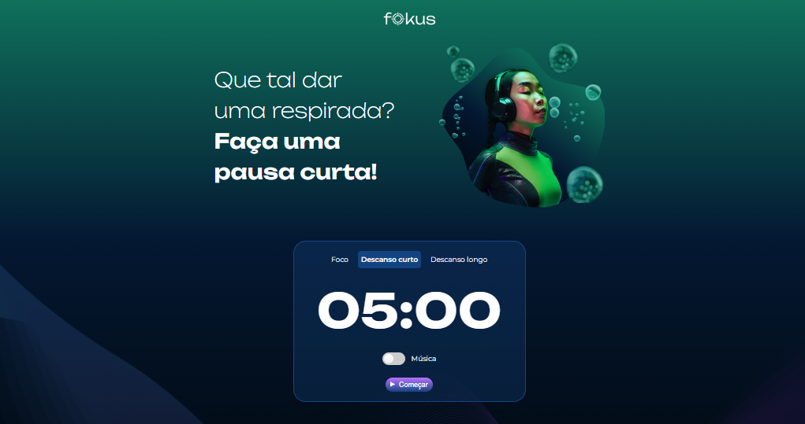

<h1 align="center"> Projeto Fokus :dart: </h1>

  <a href="#-tecnologias">Tecnologias</a>&nbsp;&nbsp;&nbsp;&nbsp;&nbsp;&nbsp;

 

  

## 🚀 Tecnologias

- JavaScript

## 💻 Projeto

Projeto realizado durante o curso de JavaScript: manipulando elementos no DOM da Alura no Programa Desenvolve 2024 | Grupo Boticário. 

---
  Desenvolvido por Thais Mabelli [Programa Desenvolve 2024 | Grupo Boticário]